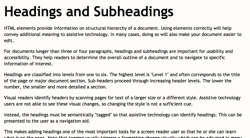
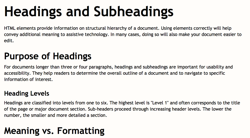

# Tips-for-Getting-Started-Writing-for-Web-Accessibility

## 翻译作业（罗昶熙161013070+罗畅明161013071+郑梓燃161013108）

### 提供信息丰富，独特的页面标题

#### 对于每个网页，提供描述页面内容的简短标题，并将其与其他页面区分开来。页面标题通常与页面的主标题相同。首先提供独特和最相关的信息; 例如，将页面名称放在组织名称之前。对于属于多步骤过程的页面，请在页面标题中包含当前步骤。

* 示例：页面标题

>主页标题

>页面名称后跟组织名称

>页面名称包括进程中的步骤

---
### 使用标题来表达意义和结构

#### 使用简短标题对相关段落进行分组，并清楚地描述各个部分。好的标题提供了内容的概述。

* 示例：使用标题来组织内容

>缺乏标题

>使用标题和副标题

---
### 使链接文本有意义

#### 编写链接文本，以便描述链接目标的内容。避免使用含糊不清的链接文本，例如“点击此处”或“阅读更多”。指示有关链接目标的相关信息，例如文档类型和大小，例如“提案文档（RTF，20MB）”。

---
### 为图像编写有意义的文本替代品

#### 对于每个图像，编写提供图像信息或功能的替代文本。对于纯装饰图像，不需要编写替代文本。

* 示例：使用替代文本来传达重要信息

>无信息：为手机充电：使用随附的电缆和电源适配器将手机连接至电源插座。图片的替代文字：“充电电话”

>信息化：为手机充电：使用随附的电缆和电源适配器将手机连接至电源插座。图像的替代文字：“将电缆插入手机的底部边缘。”

---
### 为多媒体创建成绩单和标题

#### 对于纯音频内容，这样的播客提供成绩单。对于音频和视频内容，例如培训视频，还提供字幕。在成绩单和标题中包含对理解内容很重要的口头信息和声音，例如“门吱吱”。对于视频脚本，还包括重要视觉内容的描述，例如“Athan离开房间”。
---
### 提供明确的说明

#### 确保说明，指导和错误消息清晰，易于理解，并避免使用不必要的技术语言。描述输入要求，例如日期格式。

* 1.保持内容清晰简洁

* 2.根据上下文使用简单的语言和格式。

* 3.写一些简短明了的句子和段落。

* 4.避免使用不必要的复杂单词和短语。考虑为读者可能不知道的术语提供词汇表。

* 5.首次使用时扩展首字母缩略词。例如，Web内容可访问性指南（WCAG）。

* 6.考虑为读者可能不知道的术语提供词汇表。

* 7.根据需要使用列表格式。

* 8.考虑使用图像，插图，视频，音频和符号来帮助澄清意义。

* 示例：使内容可读且易于理解

>不必要的复杂：
>>CPP：如果发生车辆碰撞，指定代表的公司将寻求确定属于所有相关方财产的损害程度和原因。一旦我们的代表获得允许我们理解因果关系的信息，我们可能会或可能不会分配适当的货币补偿。由此产生的决定可能会出现以下选项之一：索赔未获批准并被指定为拒绝状态，索赔状态不明确，并且在进一步处理之前需要其他信息，索赔部分批准并减少付款是已分配和签发，或索赔已完全批准，并且已分配和发放索赔总额。

>更容易理解：
>>索赔处理程序（CPP）：如果您发生车祸，我们的代理人将进行调查。调查结果将确定任何索赔付款。这可能导致：

>>>* 1.批准的索赔 - 全额付款

>>>* 2.部分批准的索赔 - 减少付款

>>>* 3.未确定的声明 - 需要更多信息

>>>* 4.被拒绝的索赔 - 没有付款
